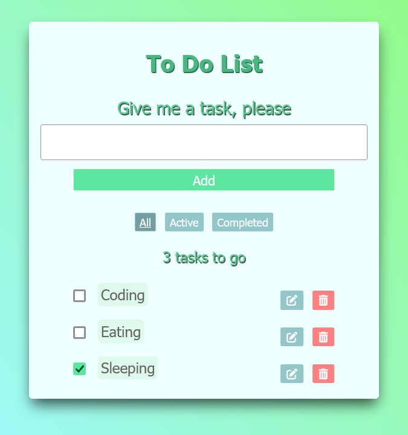

# ToDoList_React
 ToDo list build with React

Source code in todo-list/src...

Try out the calculator here [book-of-coding.com](https://book-of-coding.com/build_projects.html#todo-react)

 


### install nanoid 
[nanoid](https://github.com/ai/nanoid) - this is required so that each task returns a unique id.

In the root directory (the folder in which your "react-project" is located):
  ```
   "$ cd react-project"
  ```

then: 
  ```
   npm install nanoid
  ```

if yarn:
  ```
   yarn add nanoid
  ```

#### import nanoid to app.js  
  ```
   import { nanoid } from "nanoid";
  ```

